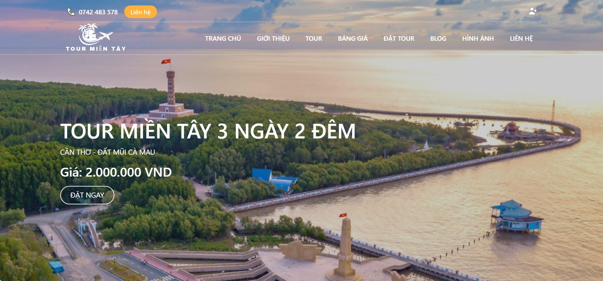
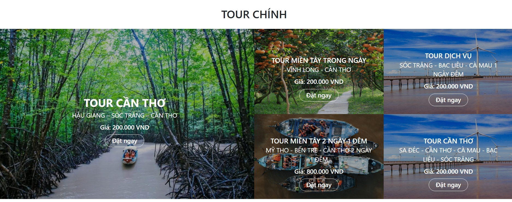
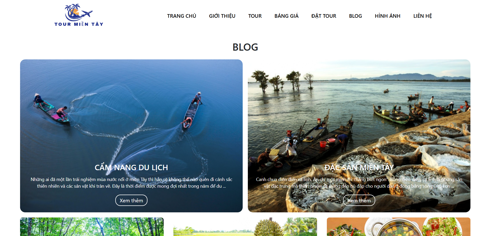
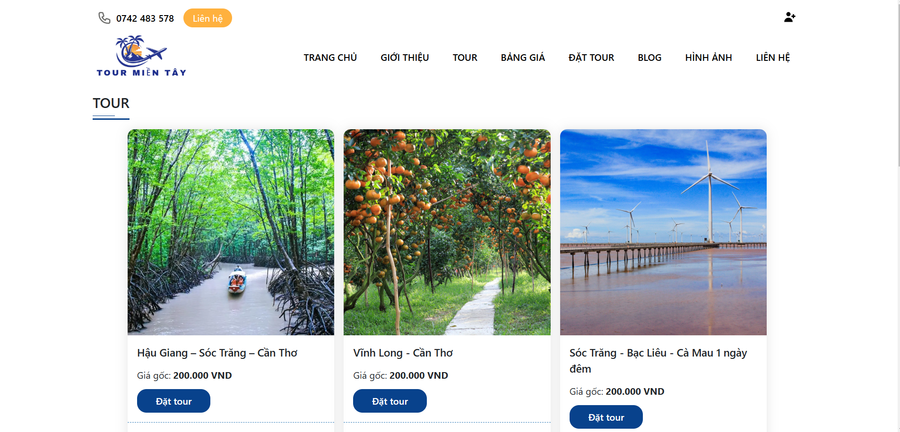
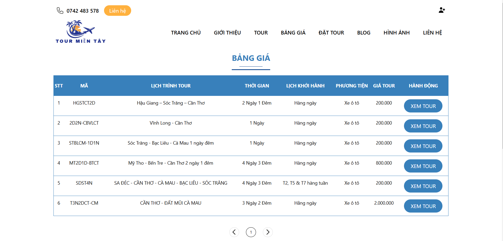
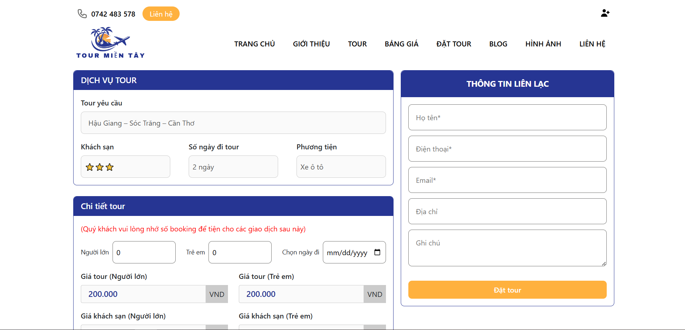
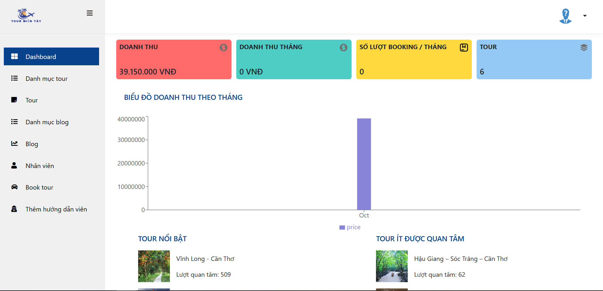
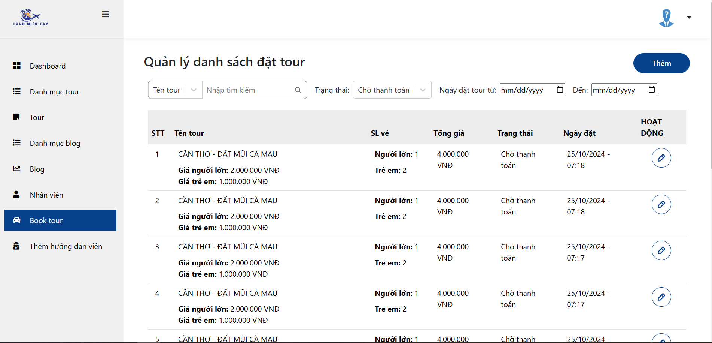

# WEBSITE GIỚI THIỆU ĐỊA ĐIỂM DU LỊCH MIỀN TÂY KẾT HỢP BOOKING

**I. Mô tả:**
Dự án phục vụ cho hai nhóm người dùng - quản trị viên và khách du lịch. Website cho phép quản trị đăng tour, bài giới thiệu địa điểm du lịch, phân công nhân viên dẫn tour, thống kê. Khách du lịch có thể xem thông tin tour, các bài viết và các địa điểm du lịch liên quan, đánh giá tour, đặt tour.

**II. Công nghệ sử dụng:**
- Ngôn ngữ lập trình: JavaScript
- Framework: ExpressJS
- Cơ sở dữ liệu: MongoDB
- Công cụ quản lý phiên bản: Git
- Khác: JWT, Postman, Node Mailer.

**III. Tính năng chính:**
Cung cấp tính năng cho 2 nhóm người dùng:
1. Quản trị viên:
    1. Xác thực
    2. Quản lý bài viết
    3. Quản lý tour
    4. Quản lý đặt tour
    5. Quản lý dẫn tour
    6. Thống kê
2. Khách du lịch:
    1. Xem tour
    2. Xem bài viết giới thiệu và các tour gợi ý
    3. Đặt tour, thanh toán online
    4. Nhận thông báo đặt tour qua Email
    5. Đánh giá tour
    
**III. Hình ảnh website:**

